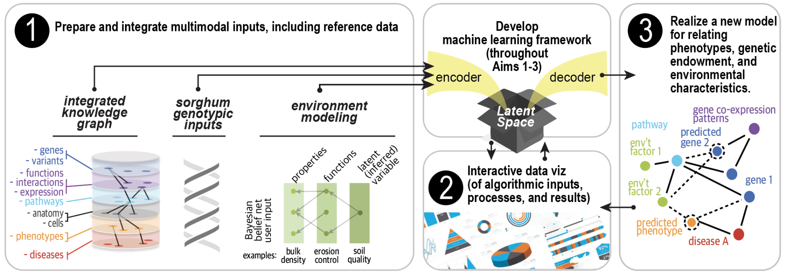

## Welcome to the GenoPhenoEnvo project

To mitigate the effects of climate change on public health and conservation, we need to better understand the dynamic interplay between biological processes and environmental effects. The state-of-the-art, which has led to many important discoveries, utilizes numerical or statistical models for making predictions or performing in silico experimentation, but these techniques struggle to capture the nonlinear response of natural systems. Machine learning (ML) methods are better able to cope with nonlinearity and have been used successfully in biological applications, but several barriers still exist, including the opaque nature of the algorithm output and the absence of ML-ready data. Here, we propose to significantly advance technologies in ML and create a new interdisciplinary field, computational ecogenomics. We propose to do this by (a) designing ML techniques for encoding heterogeneous genomic and environmental data, and mapping them to multi-level phenotypic traits, (b) reducing the amount of necessary training data, and (c) developing interactive visualizations to better interpret ML models and their outputs. **These advances will responsibly and transparently inform policy to maximize resources during this crucial window for planetary health, while revealing underlying biological mechanisms of response to stress and evolutionary pressure.**

Our long term goal is to develop predictive analytics for organismal response to environmental perturbations using innovative data science approaches. Ultimately, we hope to change the way we think about gene expression and the environment. This project will serve as proof-of-concept for an institute focused on predicting emergent properties of complex systems; an institute that would itself foster the development of many new sub-disciplines. We propose to develop a machine learning framework capable of predicting phenotypes based on multi-scale data about genes and environments. Although the available data, ranging from simple vectors to complex images to sequences, is not yet fit for this purpose, we will address this by applying our proven semantic data integration tools and experience and algorithmic data transformation methods. The central hypothesis of this research is that deep learning algorithms and biological knowledge graphs will predict phenotypes more accurately across more taxa and more ecosystems than do current numerical and traditional statistical modeling methods. The rationale for this proposal is that a timely investment in data science will push through a bottleneck in life science, accelerating discovery of gene-phenotype-environment relationships, and catalyzing a new computational discipline to uncover the complex “rules of life.” 

## Project Plan

### Support or Contact

Questions or Comments? Contact the PIs.

Anne Thessen annethessen@gmail.com

Arun Ross rossarun@cse.msu.edu

Remco Chang remco@cs.tufts.edu

Bryan Heidorn heidorn@email.arizona.edu

