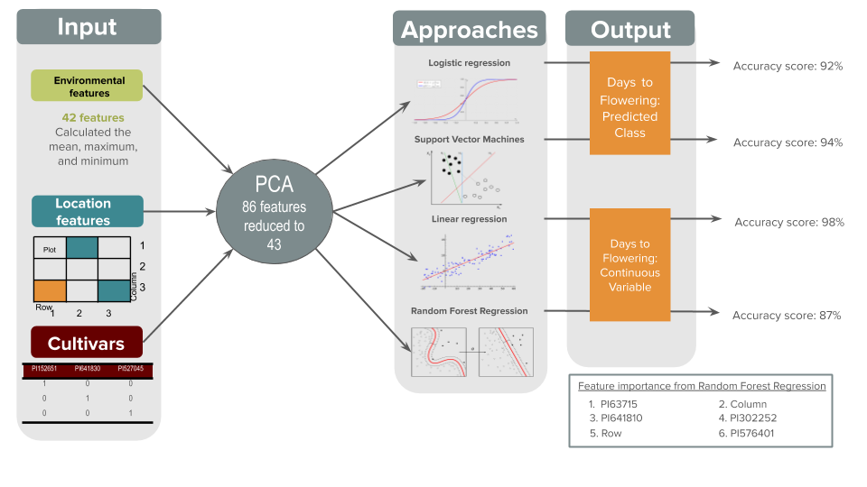

## Results (to date)

[Home](https://genophenoenvo.github.io/)  [About Us](https://genophenoenvo.github.io/about) [Results](https://genophenoenvo.github.io/results)

### Data Preparation

Phenotype
- Days to flowering
- Growing Degree Days to flowering
- Days to flag leaf emergence
- Growing Degree Days to flag leaf emergence
- Canopy height
- End of season canopy height
- Above ground dry biomass at harvest

Genotype
Produce three files for prediction
- File 1: Full VCF 
- File 2: Filter VCF based on relevant SNP identified by GWAS
- File 3: Filter VCF based on knowledge graph query for relevant genes 

Environment
- Air temperature
- Relative humidity
- Precipitation
- Wind speed and direction
- Growing degree days
- Cumulative precipitation

### Prediction and Modeling

### Summary
- Preliminary results indicate that the relationship between environmental data and phenotypic traits can be modeled with high accuracy using relatively simple models such as linear regression
- For single species, single trait predictions, a linear regression model had the highest performance
- A significance analysis based on the Random Forest Regressor suggest the importance of genes in predicting phenotypic traits

